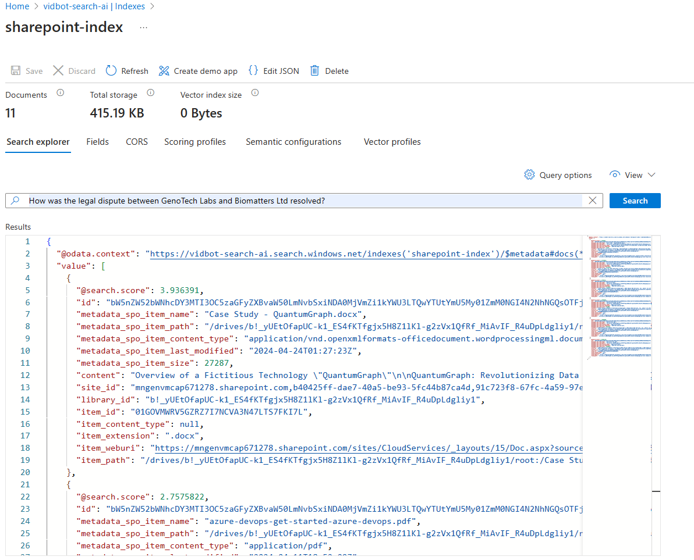

# Azure AI Search SharePoint Indexer

## Data source

Data Source Definition (JSON)

`JSON
{
  "@odata.context": "https://vidbot-search-ai.search.windows.net/$metadata##datasources/$entity",
  "@odata.etag": "\"0x8DC6629489152B8\"",
  "name": "sharepoint-datasource",
  "description": null,
  "type": "sharepoint",
  "subtype": null,
  "credentials": {
    "connectionString": "SharePointOnlineEndpoint=https://mngenvmcap671278.sharepoint.com;ApplicationId=ba85bfd5-362c-4755-ba51-3e85044c5a69;ApplicationSecret=...;"
  },
  "container": {
    "name": "useQuery",
    "query": "includeLibrary=https://mngenvmcap671278.sharepoint.com/sites/CloudServices/Shared%20Documents/Forms/AllItems.aspx"
  },
  "dataChangeDetectionPolicy": null,
  "dataDeletionDetectionPolicy": null,
  "encryptionKey": null,
  "identity": null
}
`

## Index

Query test:

Index JSON

`JSON
{
  "@odata.context": "https://vidbot-search-ai.search.windows.net/$metadata##indexes/$entity",
  "@odata.etag": "\"0x8DC64C9FE5C0264\"",
  "name": "sharepoint-index",
  "defaultScoringProfile": null,
  "fields": [
    {
      "name": "id",
      "type": "Edm.String",
      "searchable": false,
      "filterable": true,
      "retrievable": true,
      "stored": true,
      "sortable": true,
      "facetable": true,
      "key": true,
      "indexAnalyzer": null,
      "searchAnalyzer": null,
      "analyzer": null,
      "normalizer": null,
      "dimensions": null,
      "vectorSearchProfile": null,
      "synonymMaps": []
    },
    {
      "name": "metadata_spo_item_name",
      "type": "Edm.String",
      "searchable": true,
      "filterable": true,
      "retrievable": true,
      "stored": true,
      "sortable": true,
      "facetable": false,
      "key": false,
      "indexAnalyzer": null,
      "searchAnalyzer": null,
      "analyzer": null,
      "normalizer": null,
      "dimensions": null,
      "vectorSearchProfile": null,
      "synonymMaps": []
    },
    {
      "name": "metadata_spo_item_path",
      "type": "Edm.String",
      "searchable": true,
      "filterable": true,
      "retrievable": true,
      "stored": true,
      "sortable": true,
      "facetable": false,
      "key": false,
      "indexAnalyzer": null,
      "searchAnalyzer": null,
      "analyzer": null,
      "normalizer": null,
      "dimensions": null,
      "vectorSearchProfile": null,
      "synonymMaps": []
    },
    {
      "name": "metadata_spo_item_content_type",
      "type": "Edm.String",
      "searchable": true,
      "filterable": true,
      "retrievable": true,
      "stored": true,
      "sortable": false,
      "facetable": true,
      "key": false,
      "indexAnalyzer": null,
      "searchAnalyzer": null,
      "analyzer": null,
      "normalizer": null,
      "dimensions": null,
      "vectorSearchProfile": null,
      "synonymMaps": []
    },
    {
      "name": "metadata_spo_item_last_modified",
      "type": "Edm.DateTimeOffset",
      "searchable": false,
      "filterable": true,
      "retrievable": true,
      "stored": true,
      "sortable": true,
      "facetable": false,
      "key": false,
      "indexAnalyzer": null,
      "searchAnalyzer": null,
      "analyzer": null,
      "normalizer": null,
      "dimensions": null,
      "vectorSearchProfile": null,
      "synonymMaps": []
    },
    {
      "name": "metadata_spo_item_size",
      "type": "Edm.Int64",
      "searchable": false,
      "filterable": true,
      "retrievable": true,
      "stored": true,
      "sortable": true,
      "facetable": false,
      "key": false,
      "indexAnalyzer": null,
      "searchAnalyzer": null,
      "analyzer": null,
      "normalizer": null,
      "dimensions": null,
      "vectorSearchProfile": null,
      "synonymMaps": []
    },
    {
      "name": "content",
      "type": "Edm.String",
      "searchable": true,
      "filterable": false,
      "retrievable": true,
      "stored": true,
      "sortable": false,
      "facetable": false,
      "key": false,
      "indexAnalyzer": null,
      "searchAnalyzer": null,
      "analyzer": null,
      "normalizer": null,
      "dimensions": null,
      "vectorSearchProfile": null,
      "synonymMaps": []
    },
    {
      "name": "site_id",
      "type": "Edm.String",
      "searchable": false,
      "filterable": true,
      "retrievable": true,
      "stored": true,
      "sortable": false,
      "facetable": false,
      "key": false,
      "indexAnalyzer": null,
      "searchAnalyzer": null,
      "analyzer": null,
      "normalizer": null,
      "dimensions": null,
      "vectorSearchProfile": null,
      "synonymMaps": []
    },
    {
      "name": "library_id",
      "type": "Edm.String",
      "searchable": false,
      "filterable": true,
      "retrievable": true,
      "stored": true,
      "sortable": false,
      "facetable": false,
      "key": false,
      "indexAnalyzer": null,
      "searchAnalyzer": null,
      "analyzer": null,
      "normalizer": null,
      "dimensions": null,
      "vectorSearchProfile": null,
      "synonymMaps": []
    },
    {
      "name": "item_id",
      "type": "Edm.String",
      "searchable": false,
      "filterable": true,
      "retrievable": true,
      "stored": true,
      "sortable": false,
      "facetable": false,
      "key": false,
      "indexAnalyzer": null,
      "searchAnalyzer": null,
      "analyzer": null,
      "normalizer": null,
      "dimensions": null,
      "vectorSearchProfile": null,
      "synonymMaps": []
    },
    {
      "name": "item_content_type",
      "type": "Edm.String",
      "searchable": true,
      "filterable": true,
      "retrievable": true,
      "stored": true,
      "sortable": false,
      "facetable": true,
      "key": false,
      "indexAnalyzer": null,
      "searchAnalyzer": null,
      "analyzer": null,
      "normalizer": null,
      "dimensions": null,
      "vectorSearchProfile": null,
      "synonymMaps": []
    },
    {
      "name": "item_extension",
      "type": "Edm.String",
      "searchable": true,
      "filterable": true,
      "retrievable": true,
      "stored": true,
      "sortable": false,
      "facetable": false,
      "key": false,
      "indexAnalyzer": null,
      "searchAnalyzer": null,
      "analyzer": null,
      "normalizer": null,
      "dimensions": null,
      "vectorSearchProfile": null,
      "synonymMaps": []
    },
    {
      "name": "item_weburi",
      "type": "Edm.String",
      "searchable": true,
      "filterable": true,
      "retrievable": true,
      "stored": true,
      "sortable": false,
      "facetable": false,
      "key": false,
      "indexAnalyzer": null,
      "searchAnalyzer": null,
      "analyzer": null,
      "normalizer": null,
      "dimensions": null,
      "vectorSearchProfile": null,
      "synonymMaps": []
    },
    {
      "name": "item_path",
      "type": "Edm.String",
      "searchable": true,
      "filterable": true,
      "retrievable": true,
      "stored": true,
      "sortable": true,
      "facetable": false,
      "key": false,
      "indexAnalyzer": null,
      "searchAnalyzer": null,
      "analyzer": null,
      "normalizer": null,
      "dimensions": null,
      "vectorSearchProfile": null,
      "synonymMaps": []
    }
  ],
  "scoringProfiles": [],
  "corsOptions": null,
  "suggesters": [],
  "analyzers": [],
  "normalizers": [],
  "tokenizers": [],
  "tokenFilters": [],
  "charFilters": [],
  "encryptionKey": null,
  "similarity": {
    "@odata.type": "##Microsoft.Azure.Search.BM25Similarity",
    "k1": null,
    "b": null
  },
  "semantic": null,
  "vectorSearch": null
}
`

## Skillset

Skillset Definition (JSON)

`JSON
{
  "@odata.context": "https://vidbot-search-ai.search.windows.net/$metadata##skillsets/$entity",
  "@odata.etag": "\"0x8DC662948960CF7\"",
  "name": "aoai-embedding-skill",
  "description": "Skillset with text split and embedding skills",
  "skills": [
    {
      "@odata.type": "##Microsoft.Skills.Text.SplitSkill",
      "name": "##1",
      "description": null,
      "context": "/document/content",
      "defaultLanguageCode": "en",
      "textSplitMode": "pages",
      "maximumPageLength": 1000,
      "pageOverlapLength": 0,
      "maximumPagesToTake": 0,
      "inputs": [
        {
          "name": "text",
          "source": "/document/content"
        }
      ],
      "outputs": [
        {
          "name": "textItems",
          "targetName": "mycontent"
        }
      ]
    },
    {
      "@odata.type": "##Microsoft.Skills.Text.AzureOpenAIEmbeddingSkill",
      "name": "##2",
      "description": null,
      "context": "/document/mycontent/*",
      "resourceUri": "https://ai-vidbotai310088799584.openai.azure.com",
      "apiKey": "<redacted>",
      "deploymentId": "text-embedding-ada-002",
      "inputs": [
        {
          "name": "text",
          "source": "/document/mycontent/*"
        }
      ],
      "outputs": [
        {
          "name": "embedding",
          "targetName": "embedding"
        }
      ],
      "authIdentity": null
    }
  ],
  "cognitiveServices": null,
  "knowledgeStore": null,
  "indexProjections": null,
  "encryptionKey": null
}
`

## Indexer

Indexer Definition (JSON)

`JSON
{
  "@odata.context": "https://vidbot-search-ai.search.windows.net/$metadata##indexers/$entity",
  "@odata.etag": "\"0x8DC652B92582C77\"",
  "name": "sharepoint-indexer",
  "description": null,
  "dataSourceName": "sharepoint-datasource",
  "skillsetName": "aoai-embedding-skill",
  "targetIndexName": "sharepoint-index",
  "disabled": null,
  "schedule": null,
  "parameters": {
    "batchSize": null,
    "maxFailedItems": null,
    "maxFailedItemsPerBatch": null,
    "base64EncodeKeys": null,
    "configuration": {
      "indexedFileNameExtensions": ".pdf, .docx",
      "excludedFileNameExtensions": ".png, .jpg",
      "dataToExtract": "contentAndMetadata",
      "indexStorageMetadataOnlyForOversizedDocuments": true
    }
  },
  "fieldMappings": [
    {
      "sourceFieldName": "metadata_spo_site_library_item_id",
      "targetFieldName": "id",
      "mappingFunction": {
        "name": "base64Encode",
        "parameters": null
      }
    },
    {
      "sourceFieldName": "content",
      "targetFieldName": "content",
      "mappingFunction": null
    },
    {
      "sourceFieldName": "metadata_spo_site_id",
      "targetFieldName": "site_id",
      "mappingFunction": null
    },
    {
      "sourceFieldName": "metadata_spo_library_id",
      "targetFieldName": "library_id",
      "mappingFunction": null
    },
    {
      "sourceFieldName": "metadata_spo_item_id",
      "targetFieldName": "item_id",
      "mappingFunction": null
    },
    {
      "sourceFieldName": "metadata_spo_item_last_modified",
      "targetFieldName": "metadata_spo_item_last_modified",
      "mappingFunction": null
    },
    {
      "sourceFieldName": "metadata_spo_item_name",
      "targetFieldName": "metadata_spo_item_name",
      "mappingFunction": null
    },
    {
      "sourceFieldName": "metadata_spo_item_size",
      "targetFieldName": "metadata_spo_item_size",
      "mappingFunction": null
    },
    {
      "sourceFieldName": "metadata_spo_item_content_type",
      "targetFieldName": "metadata_spo_item_content_type",
      "mappingFunction": null
    },
    {
      "sourceFieldName": "metadata_spo_item_extension",
      "targetFieldName": "item_extension",
      "mappingFunction": null
    },
    {
      "sourceFieldName": "metadata_spo_item_weburi",
      "targetFieldName": "item_weburi",
      "mappingFunction": null
    },
    {
      "sourceFieldName": "metadata_spo_item_path",
      "targetFieldName": "item_path",
      "mappingFunction": null
    }
  ],
  "outputFieldMappings": [],
  "cache": null,
  "encryptionKey": null
}
`
